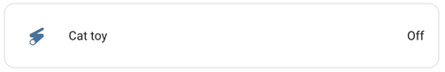
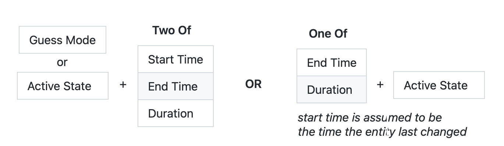

# Timer Bar Card

A progress bar display for [Home Assistant][home-assistant] timers. Show the time left on your dishwasher, kitchen timer, 3D Printer, sprinklers, time-controlled lights *(even plain ol' switches with automations)*, washing machine, and [much more](#integration-support-status)!


<table><tr><td>

### 🍄 Newly Added: Mushroom Styling 🍄

I've been really enjoying Paul Bottein's beautiful [Mushroom card collection](https://github.com/piitaya/lovelace-mushroom), so I've added new styles to make the card feel at home in your mushroom garden. Jump to [Configuring the Mushroom Style](#mushroom-style) for examples.


</td></tr></table>

The card is also well tested. There are [24 tests](https://github.com/rianadon/timer-bar-card/tree/main/test), and they've helped me catch a few bugs already. 🐞

**You may also be interested in these other related but unaffiliated cards:**
- @Gluwc's [Bar Card](https://github.com/custom-cards/bar-card) for numerical quantities or percentages
- @pmongloid's [Flipdown Timer Card](https://github.com/pmongloid/flipdown-timer-card) for timers but it has a cool flip effect!

*Jump to:  [[Integration Support Status](#integration-support-status)]
[[Turn On/Turn Off Switch](#turn-on-a-switch-for-some-time-then-turn-it-off)]
[[Styling Examples](#-styling-examples)]<br>
[[Working with New Integrations](#-working-with-new-integrations)]
[[Examples](#examples)]
[[Troubleshooting](#troubleshooting)]*

## Installation

Timer Bar Card is available from [HACS][hacs], the Home Assisstant Community Store.

If you don't have HACS installed, follow the [manual installation](#manual-installation) instructions.

## Configure the Card

The card displays [Home Assistant timers][Home Assistant timer] with minimal configuration.

<table><tr><th>YAML Configuration</th><th>Timer Bar Card</th></tr><tr><td><p></p>

```yaml
type: custom:timer-bar-card
entities:
  - timer.alarm
  - timer.alarm_two
  - timer.alarm_three
```

</td><td>

</td></tr></table>

Most integrations require adding at least one or two additional lines of YAML configuration so the card knows the format of the timer. For more information on how these options work, see [Working with New Integrations](#-working-with-new-integrations).

### Integration Support Status

<pre><code><b>🌈 Did you configure the card for another integration? 🌈</b>
I'd love to add it here! Please submit an <a href="https://github.com/rianadon/timer-bar-card/issues/new?template=tell-me-about-an-integration-you-got-working.md">issue</a> with the integration name and your configuration!
</code></pre>

| Integration                       | Status               | Extra configuration required                             |
|-----------------------------------|----------------------|----------------------------------------------------------|
| [Home Assistant timer]            | *supported & tested* | no! 🎉                                                   |
| Automation-controlled<br>switches | *supported & tested* | [set `duration` to `{ fixed: x:xx:xx }`][fixed-duration] |
| [Sun]                             | *supported*          | [See the example](#sun)                                  |
| [OpenSprinkler][opensprinkler]    | *supported*          | no! 🎊 ([example][opensprinkler-example])                |
| [Amazon Alexa Timer]              | *supported*          | `start_time`, `end_time`, and `guess_mode` [[#22]], or [[#166]] |
| [Anova Sous Vide]                 | *supported*          | `active_state`, `end_time` [[#176]] (♡ @kristoficko!)    |
| [Bambu Lab]                       | *supported*          | `active_state`, `end_time` [[#143]] (♡ @andrewtimosca)   |
| [BMW Connected Drive][bmw]        | *supported*          | `active_state`, `end_time` [[#60]] (♡ @hoeni!)           |
| [Cleverio Sous Vide (Tuya)]       | *supported*          | multiple: see [#67] (thanks @develop-daraf!)             |
| [Daily Schedule]                  | *supported*          | `active_state`, `end_time` [[#80]] (♡ @igorsantos07)     |
| [Google Home Timer]               | *supported*          | [auto-entities card][#140] or [template entity][#19]     |
| [Home Connect] †                  | *supported*          | `active_state`, `end_time` [[#36]] (♡ @rickdeck!)        |
| [HomeWhiz] ‡                      | *supported*          | multiple: see [#121] (thanks @GigiPompieru)              |
| [Irrigation Unlimited]            | *supported*          | `duration` and `start_time` [[#5]]                       |
| [Meater]                          | *supported*          | `active_state`, `end_time` [[#122]] (♡ @Bascht74!)       |
| [Miele]                           | *supported*          | [template entity required: see #62][#62]                 |
| [Moonraker]                       | *supported*          | mutliple: see [#107] (thanks @user74656!)                |
| [OctoPrint][octoprint]            | *supported*          | multiple: see [#58] (thanks @schmacka!)                  |
| [PrusaLink]                       | *supported*          | start+end time, `guess_mode` [[#106]] (♡ @deadly667!)    |
| [Public Transport]<br>[Departures]| *supported*          | `guess_mode`, `end_time` [[#188]] (thanks @alex-jung!)   |
| [RainMachine]                     | *supported*          | multiple: see [#46] (thanks @shbatm!)                    |
| [SmartThings]                     | *supported*          | multiple: see [#45] (thanks @TheRedBull205!)             |
| [Tesla]                           | *supported*          | [template entity required: see #98][#98]                 |
| [ThinQ washer/dryer]              | *supported*          | configure `duration` to `initial_time` [[#15]]           |
| [ThinQ dishwasher]                | *supported*          | multiple: see [#70] (thanks @ollo69 for the help)        |
| [Google Home Alarm]               | *not really [[#18]]* | template entity required                                 |

[fixed-duration]: #6-ugh-i-know-what-the-duration-is-but-its-nowhere-in-home-assistant
[opensprinkler-example]: #use-with-opensprinkler-integration
[#5]: https://github.com/rianadon/timer-bar-card/issues/5#issuecomment-868267817
[#15]: https://github.com/rianadon/timer-bar-card/issues/15#issuecomment-1361079381
[#18]: https://github.com/rianadon/timer-bar-card/issues/18#issuecomment-1179868528
[#19]: https://github.com/rianadon/timer-bar-card/issues/19#issuecomment-923650295
[#22]: https://github.com/rianadon/timer-bar-card/issues/22#issue-997903510
[#36]: https://github.com/rianadon/timer-bar-card/issues/36
[#45]: https://github.com/rianadon/timer-bar-card/issues/45
[#46]: https://github.com/rianadon/timer-bar-card/issues/46
[#58]: https://github.com/rianadon/timer-bar-card/issues/58
[#60]: https://github.com/rianadon/timer-bar-card/issues/60
[#62]: https://github.com/rianadon/timer-bar-card/issues/62#issuecomment-1331493239
[#67]: https://github.com/rianadon/timer-bar-card/issues/67
[#70]: https://github.com/rianadon/timer-bar-card/issues/70#issuecomment-1439493141
[#80]: https://github.com/rianadon/timer-bar-card/issues/80
[#98]: https://github.com/rianadon/timer-bar-card/issues/98
[#106]: https://github.com/rianadon/timer-bar-card/issues/106
[#107]: https://github.com/rianadon/timer-bar-card/issues/107
[#121]: https://github.com/rianadon/timer-bar-card/issues/121
[#122]: https://github.com/rianadon/timer-bar-card/issues/122
[#140]: https://github.com/rianadon/timer-bar-card/pull/140
[#143]: https://github.com/rianadon/timer-bar-card/issues/143
[#166]: https://github.com/rianadon/timer-bar-card/pull/166
[#176]: https://github.com/rianadon/timer-bar-card/issues/176
[#188]: https://github.com/rianadon/timer-bar-card/issues/188
[Sun]: https://www.home-assistant.io/integrations/sun/
[Home Assistant timer]: https://www.home-assistant.io/integrations/timer/
[ThinQ washer/dryer]: https://github.com/ollo69/ha-smartthinq-sensors
[ThinQ dishwasher]: https://github.com/ollo69/ha-smartthinq-sensors
[Google Home Alarm]: https://github.com/leikoilja/ha-google-home
[Google Home Timer]: https://github.com/leikoilja/ha-google-home
[Amazon Alexa Timer]: https://github.com/custom-components/alexa_media_player
[Home Connect]: https://www.home-assistant.io/integrations/home_connect/
[Irrigation Unlimited]: https://github.com/rgc99/irrigation_unlimited
[SmartThings]: https://www.home-assistant.io/integrations/smartthings/
[RainMachine]: https://www.home-assistant.io/integrations/rainmachine/
[Octoprint]: https://www.home-assistant.io/integrations/octoprint/
[bmw]: https://www.home-assistant.io/integrations/bmw_connected_drive
[Miele]: https://github.com/HomeAssistant-Mods/home-assistant-miele/
[Cleverio Sous Vide (Tuya)]: https://www.home-assistant.io/integrations/tuya/
[Daily Schedule]: https://github.com/amitfin/daily_schedule
[PrusaLink]: https://www.home-assistant.io/integrations/prusalink/
[Moonraker]: https://github.com/marcolivierarsenault/moonraker-home-assistant
[Meater]: https://www.home-assistant.io/integrations/meater/
[HomeWhiz]: https://github.com/home-assistant-HomeWhiz/home-assistant-HomeWhiz
[Tesla]: https://github.com/alandtse/tesla
[Bambu Lab]: https://github.com/greghesp/ha-bambulab
[Anova Sous Vide]: https://www.home-assistant.io/integrations/anova
[Public Transport]: https://github.com/alex-jung/ha-departures
[Departures]: https://github.com/alex-jung/ha-departures

† *BSH appliances - Bosch/Siemens/Neff/Gagenau. Check out [issue #36][#36] for the full card configuration!*\
‡ *Devices connected through the HomeWhiz app: Beko, Grundig, and Arcelik brands*

If your configuration isn't listed, follow the instructions in [Working with New Integrations](#-working-with-new-integrations). Once you configure it, I'd super appreciate if you [could submit an issue](https://github.com/rianadon/timer-bar-card/issues/new?template=tell-me-about-an-integration-you-got-working.md) with the integration's name and your configuration. You'll get a mention in this document and help others save time. 🌈

### Turn On a Switch for Some Time, Then Turn it Off


This is a common use case of the card, so here's a full example of how you can create a button on your dashboard to turn on a switch entity, count down ten seconds, then turn the entity off. This takes a few different components in Home Assistant: The *Timer Bar Card*, a *Script*, and *an Automation (optional)*

While the script is shown in YAML mode, you can alternatively create it in the visual editor (the *Scripts* tab in the same area as *Automations*).

<table><tr><th>Card Configuration</th><th>Script Configuration</th></tr><tr><td><p></p>

```yaml
type: custom:timer-bar-card
entities:
  - switch.cat_toy
duration:
  script: script.switch_on_10s
tap_action:
  action: call-service
  service: script.switch_on_10s
hold_action:
  action: more-info

```

</td><td><p></p>

```yaml
alias: Turn the switch on then off
sequence:
  - service: homeassistant.turn_on
    data: {}
    target:
      entity_id: switch.cat_toy
  - delay: "00:00:10"
  - service: homeassistant.turn_off
    data: {}
    target:
      entity_id: switch.cat_toy
mode: single # also consider restart
```

</td></tr></table>

In this example, the switch's id is `switch.cat_toy` and the script's id is `script.switch_on_10s`.

The card is given two actions: clicking/tapping it will calll the script, and holding it will bring up the switch entity's information. The script uses the *Call Service* action to turn on and off the switch.

> ⚠️ Make sure that if you're creating the script from the UI, you do not rename the delay action. The delay needs to have the duration at the end of its name (e.g. `delay action 0:01:12`)—this is how the card knows how long the timer is. You shouldn't need to rename the action in most cases, except if the duration is really small (sometimes the automatic name is `delay for 10 seconds` which does not parse).

> The script's name is parsed because finding its true duration would require the card to independently access the Home Assistant API rather than using the shared state. I'm trying to keep this simple.

Using a script has several advantages:
- It does not interfere with manual operation of the switch.
- You can create multiple buttons to turn the same switch on for different amounts of time.
- If you create a new script for each button, the timer bar will only show on the button that was pressed.

However, you may wish to ensure that even under manual operation, the switch is never turned on for more than ten seconds.
In this case, you can add an automation that is trigggered when `switch.cat_toy`'s *state* changes to *on*  and that calls the `script.turn_on` service with entity `script.script_on_10s`.



#### Simplifying with only an Automation + Card

If both the automation and the button are going to keep the switch on for the same amount of time, you can simplify the setup and **not use a script**.
Add the delay and switch off services to the automation (or set the automation to only trigger when the switch is on for 10s) and change the card's `duration: script` option to `duration: fixed: "00:00:10"`.
Also change the tap action to either call the switch's turn on service or toggle the switch. If you change the automation's delay in the future, make sure to update the card too.


<table><tr><th>Card Configuration</th><th>Automation Configuration</th></tr><tr><td><p></p>

```yaml
type: custom:timer-bar-card
entities:
  - switch.cat_toy
duration:
  fixed: 00:00:10
tap_action:
  action: toggle
hold_action:
  action: more-info

```

</td><td><p></p>

```yaml
alias: Turn the switch off after it is turned on
trigger:
  - platform: state
    entity_id: switch.cat_toy
    to: "on"
condition: []
action:
  - delay: "00:00:10"
  - service: homeassistant.turn_off
    data: {}
    target:
      entity_id: switch.cat_toy
mode: single # also consider restart
```

</td></tr></table>

### 🎨 Styling Examples

<table><tr>
<td><p></p><a href="#receding-progress-bar"><p align="center">RECEDING PROGRESS BAR</p>
</a></td>
<td><p></p><a href="#show-only-progress-bar"><p align="center">SHOW ONLY PROGRESS BAR</p>
</a></td>
<td><p></p><a href="#use-with-paper-buttons-row"><p align="center">USE WITH PAPER BUTTONS ROW</p>
</a></td>
</tr><tr>
<td><p></p><a href="#customize-appearance-based-on-timer-percentage"><p align="center">CUSTOMIZE APPEARANCE BASED ON TIMER PERCENTAGE</p>
</a></td>
<td><p></p><a href="#icons-and-entity-in-card-header"><p align="center">ICONS AND ENTITY IN CARD HEADER</p>
</a></td>
<td><p></p><a href="#embedded-in-an-entities-card"><p align="center">EMBEDED IN AN ENTITIES CARD</p>
</a></td>
</tr><tr>
<td><p></p><a href="#rename-entities-and-statuses"><p align="center">RENAME ENTITIES AND STATUSES</p>
</a></td>
<td><p></p><a href="#style-to-your-unique-tastes"><p align="center">STYLE TO YOUR UNIQUE TASTES</p>
</a></td>
<td><p></p><a href="#mushroom-style"><p align="center">MUSHROOM STYLE</p>
</a></td>
</tr></table>

See also: [Use Templates in Configuration](#use-templates-in-configuration)

### 📦 Working with New Integrations

<p align="center"></p>

The diagram above shows the minimal configuration you'll need to make the card show the timer. For each of these properties, you'll need to find an entity **(doesn't have to be the one you're displaying in the card)** that has this information in its state or attributes. The only exception is *Guess Mode*, which is an option you set on the card to make it guess when the timer is active in lieu of configuring an *Active State*.

> ⏰ There is an option missing in this diagram: *Remaining Time*. Some integrations have a *Remaining Time* attribute, but the attribute does not update every second like a countdown! This is to reduce the strain on your Home Assistant: Lot of entities updating every second could slow it down.
>
> However, some integrations do update a *Remaining Time* attribute (or create an entity whose state is the *Remaining Time* and update its state every second). For these, you can use (*Remaining Time* + one of *Start Time*/*Duration* + *Guess Mode* or *Active State*) **or** (*Remaining Time* + *Active State*)

<a href="https://my.home-assistant.io/redirect/developer_states/"></a>
The Developer Tools are a great resource for viewing states and attributes.

<br>


> 📝 In the screenshot above, *Duration* and *End Time* are the attributes `duration` and `finishes_at`, and the state `active` can be used as the *Active State*.

Here's all the options you can use in the configuration. I recommend setting `debug: true` while setting up the card to help work through any problems.

| YAML option     | Type            | Description                                    | Default                                                |
|-----------------|-----------------|------------------------------------------------|--------------------------------------------------------|
| active_state    | string<br>/list | State(s) used to indicate a timer is running   | `active`, `on`, `manual`,<br>`program`, `once-program` |
| pause_state     | string<br>/list | State(s) used to indicate a timer is paused    | `paused`                                               |
| waiting_state   | string<br>/list | State(s) when a timer is scheduled for later † | `waiting`                                              |
| state           | `{fixed: string}`| Explicitly specify a state without an entity. | -                                                      |
| state_attribute | string          | Use an attribute when calculating the above.   | -                                                      |
| guess_mode      | bool            | Attempt to guess mode=active. ‡                | `false`                                                |
| start_time      | [*timeprop*]    | How the timer's start time is found            | `{attribute: start_time}`                              |
| end_time        | [*timeprop*]    | How the timer's end time is found              | `{attribute: end_time}`                                |
| duration        | [*timeprop*]    | How the timer's duration is found              | `{attribute: duration}`                                |
| remain_time     | [*timeprop*]    | How the timer's remaining time is found        | `{attribute: remain_time}`                             |
| debug           | bool            | Show debugging info in card                    | `false`                                                |

[*timeprop*]: #configuration-of-time-properties-start_time-end_time-etc

```
timeprop = { attribute: string, units: "duration"|"hours"|"minutes"|"seconds" = "duration" }
         | { entity: string, attribute?: string, units="duration" } | { script: string }
         | { fixed: number, units="duration" } | { state: any, units="duration" }
```

† requires a `start_time` attribute to calculate when in the future the timer will start. \
‡ `waiting_state` and `pause_state` will still have an effect, but the card will disregard `active_state` if it can guess the timer mode.

To recap, set `active_state` to the state of your entity while the timer is running (usually all lowercase). If the state changes as the timer runs (for instance if the state is the number of seconds left in the timer), check if any of the attributes indicate whether the timer is running. If so, use `active_state` together with `state_attribute`, otherwise, set `guess_mode: true` and make sure you have two of `start_time`/`end_time`/`duration` set.

#### Specifying timers without an entity

For advanced usage, you can specify all properties of a timer directly, without using an entity.  In this case, the `entity` field is optional, and is only used to open the more-info popup when clicked.

To do this, pass `{fixed: <value>}` for the `state` property and any 2 of the time/duration properties above.  This mode ignores the `*_state` fields; the `fixed:` value must be exactly `active`, `paused`, or `waiting`.

#### Configuration of time properties (`start_time`, `end_time`, etc)

These examples all use `duration`, but they are applicable for all of the time properties: `start_time`, `end_time`, and `remain_time` as well.

##### 1. My entity has an attribute that looks like `duration` (for example, `timespan`). Supply the following configuration:

```yaml
type: custom:timer-bar-card
entities:
  - switch.my_switch
duration:
  attribute: "timespan" # If your your duration attribute looks like 0:10:00.
debug: true
```

##### 2. My `duration` isn't in the `0:10:00` format! I need to use different units!

Use the `units` property and specify `seconds`, `hours`, or `minutes`. The default value of `units` is `duration`, which expects the `hh:mm:ss` (duration/remaining) or `2021-09-07T20:24:13+00:00` (start/end time) format.

```yaml
duration:
  attribute: "timespan" # Should look like 10 or 10.0
  units: minutes
debug: true
```

##### 3. My duration comes from another entity

Assume there's a duration slider with id `input_number.slider1`. The available units are the same ones as above. You can also combine `entity` and `attribute` together if you need to fetch an attribute from a different entity!

```yaml
type: custom:timer-bar-card
entities:
  - switch.my_switch # ID of the switch, which provides the active/idle status
duration:
  entity: input_number.slider1
  units: minutes # Since the slider state is a number like 10.0
debug: true
```

##### 4. My duration comes from the entity's state

Set `duration: { state: true }`. This is less common for duration, but some integrations give the *End Time* as an entity with format like `2021-09-07T20:24:13+00:00` (you don't need `units` for start/end time).

```yaml
duration:
  state: true
debug: true
```

##### 5. A script determins when the entitty turns off

The duration will be fetched from the length of the *Delay* action in the script.
For this to work, the *Delay* action must not be renamed or configured with the `alias` property in the YAML.

```yaml
duration:
  script: script.my_script_id
debug: true
```

##### 6. Ugh. I know what the duration is but it's nowhere in Home Assistant

If there's no state or attribute in Home Assistant which shows your duration, you can give the duration to the card.
The units also work here, if you don't like using the `hh:mm:ss` format.

```yaml
type: custom:timer-bar-card
entities:
  - switch.my_switch
duration: { fixed: 0:05:00 } # 5 min
debug: true
```

Once the card is working properly, you can safely remove `debug: true`. It doesn't affect any of the functionality.

<pre><code><h3>Still unclear? Don't know if you can make your entity work with the card?</h3>
🧡 Please create an issue and tell me the entity so I can improve these instructions! ❤️️
</code></pre>

### The Rest of the Configuration Options (📚 Reference)

| Name              | Type    | Requirement     | Description                                          |
| ----------------- | ------- | ------------    | -------------------------------------------          |
| type              | string  | **Required**    | `custom:timer-bar-card`                              |
| entity            | string  | **Optionalish** | Display a single entity, for use in `entities` cards |
| entities          | list    | **Optionalish** | Display multiple entities in a card                  |

Either `entity` or `entities` must be supplied. Use `entity` if you'd like to embed the timer inside a card, or `entities` if you would like to create your own card (and use the card options at the end of this section).

### Customization

Optional properties to change icons, colors, and sizes.

| Name           | Type    | Requirement  | Description                                                                                                | Default           |
|----------------|---------|--------------|------------------------------------------------------------------------------------------------------------|-------------------|
| icon           | string  | **Optional** | Customize the icon to show next to the timer                                                               | -                 |
| image          | string  | **Optional** | Customize the image url to show in place of the icon                                                       | -                 |
| state_color    | boolean | **Optional** | Change the icon's color if the timer is active                                                             | -                 |
| active_icon    | string  | **Optional** | Override `icon` when timer is active                                                                       | -                 |
| text_width     | string  | **Optional** | Space alotted for the time remaining (i.e. right offset of bar)                                            | `3.5em`           |
| invert         | boolean | **Optional** | Make the progress bar count down (start at 100%, end at 0%)                                                | -                 |
| bar_width      | string  | **Optional** | Width of progress bar (decrease if the entity name is cut off)                                             | `calc(70% - 7em)` |
| bar_height     | string  | **Optional** | Height of progress bar                                                                                     | `8px`             |
| bar_foreground | string  | **Optional** | Foreground color of progress bar                                                                           | primary color †   |
| bar_background | string  | **Optional** | Background color of progress bar                                                                           | `#eee`            |
| bar_radius     | string  | **Optional** | Border radius of the progress bar                                                                          | -                 |
| bar_direction  | string  | **Optional** | Override the direction of bar progress. Can be `ltr` or `rtl`                                              | -                 |
| layout         | string  | **Optional** | Hide the name (`hide_name`) and (optionally icon—`full_row`)                                               | `normal`          |
| resolution     | string  | **Optional** | Set to `seconds`, `minutes`, or `automatic` to switch between `h:m:s` and `h:m` formats.                   | `seconds`         |
| format         | string  | **Optional** | Overrides resolution. [Set] to `hms`/`hm`/`d`/`h`/`m`/`s` or use string interpolation like `%m minutes`    | `hms`             |
| modifications  | array   | **Optional** | Adjustments to make depending on percentage ([example](<#customize-appearance-based-on-timer-percentage>)) | -                 |
| translations   | dict    | **Optional** | Mapping of substitutions for status text                                                                   |                   |

† the primary color is taken from your theme using `var(--mdc-theme-primary, #6200ee);`

[Set]: https://github.com/rianadon/timer-bar-card/blob/main/test/format-time.test.ts

### Card options

Customize the header and display of entities within the card. To use the card, <code>entities</code> must be defined.

 | Name             | Type    | Requirement  | Description                                             | Default |
 |------------------|---------|--------------|---------------------------------------------------------|---------|
 | name             | string  | **Optional** | Card name / title                                       | -       |
 | compressed       | boolean | **Optional** | Decrease vertical spacing between entities              | `false` |
 | filter           | boolean | **Optional** | Only show non-idle timers and sort them by their status | `false` |
 | show_empty       | string  | **Optional** | If `filter` selects no entities, show this text instead | -       |
 | header_entity    | string  | **Optional** | Replace title with the icon & name of an entity †       | -       |
 | header_secondary | string  | **Optional** | Show additional information under header_entity ‡       | -       |

† If you specify `header_entity`, the `name` option will no longer have any effect. \
‡ See the `secondary_info` parameter in the [entities documentation](<https://www.home-assistant.io/lovelace/entities/#secondary_info>) for a list of possible values.

### Actions

You can also use [actions](https://www.home-assistant.io/lovelace/actions/) with this card to trigger services or perform actions in the dashboard when the card is clicked. The action configuration options are `hold_action`, `tap_action`, and `double_tap_action`.

## Examples

### Receding progress bar

By default, the progress bar will expand. If you'd like the bar instead to shrink (as if it were counting down, rather than counting up), reverse the bar direction and invert the percentage:


```yaml
bar_direction: rtl # omit this for a left-aligned progress bar
invert: true
```

This example uses the `bar_radius` option to round the edges of the progress bar. I like my progress bars advancing from left to right, but you can keep the bar aligned to the left by omitting `bar_direction: rtl`.

### Use with [OpenSprinkler integration][opensprinkler]


```yaml
entities:
  - sensor.s14_station_status
  - sensor.s15_station_status
  - sensor.s16_station_status
type: custom:timer-bar-card
name: Sprinkler
active_state: # This option isn't needed due to the defaults
  - manual
  - program
bar_width: 35%
compressed: true
filter: true # So only the running and scheduled stations are shown
```

Be sure to check out the Irrigation Unlimited and RainMachine [examples](https://github.com/rianadon/timer-bar-card#integration-support-status) if you use a different irrigation controller.

<a name="sun"></a>
### Using `active_state`, `end_time`, etc: The sun integration

I adore this example because it uses so many configuration options at once to create a timer I never would have dreamed of until [#71](https://github.com/rianadon/timer-bar-card/issues/71). The sun entity has two states: above horizon or below horizon. The configuration defines only an `end_time`, letting the card pick up when the sun entity last changed states as its start times. The `translations` option provides alternate text to show when the timer is not running.


Even though I took this screenshot in the dark theme, it's still daytime.

```yaml
type: custom:timer-bar-card
name: Sun
entities:
  - entity: sun.sun
    name: Sunrise
    icon: mdi:weather-sunset-up
    active_state: below_horizon
    end_time:
      attribute: next_rising
    translations:
      above_horizon: Not yet ☀️
  - entity: sun.sun
    name: Sunset
    icon: mdi:weather-sunset-down
    active_state: above_horizon
    end_time:
      attribute: next_setting
    translations:
      below_horizon: Not yet 🌙
text_width: 5em
bar_radius: 4px
```


### Embedded in an entities card


```yaml
title: Timer
type: entities
entities:
  - entity: timer.alarm
    type: custom:timer-bar-card
  - entity: timer.alarm_two
    type: custom:timer-bar-card
  - entity: timer.alarm_three
    type: custom:timer-bar-card
```

### Icons and entity in card header


```yaml
entities:
  - timer.water_timer
  - timer.water_timer2
  - timer.water_timer3
type: custom:timer-bar-card
icon: mdi:water-outline
active_icon: mdi:water
compressed: true
header_entity: binary_sensor.sprinklers
header_secondary: last-changed
```

Home Assistant `configuration.yaml`:

```yaml
timer:
  water_timer:
    name: Front Lawn
    duration: "00:15:00"
  water_timer_2:
    ...

template:
  - binary_sensor:
      - name: "Sprinklers"
        icon: mdi:sprinkler-variant
        state: "{{ states.timer| selectattr('state', 'in', ['paused', 'active'] ) | list | count }}"
```

[Go to the end for themes and multicolored icons](#themes)

### Style to your unique tastes


```yaml
type: custom:timer-bar-card
entities:
- timer.alarm
- timer.alarm_two
bar_height: 20px
bar_background: '#222'
bar_foreground: 'linear-gradient(to right, red, orange, yellow, green, cyan, blue, violet)'
text_width: 6em
bar_width: 40%
```

### Customize appearance based on timer percentage


```yaml
type: custom:timer-bar-card
entities:
  - timer.alarm
modifications:
  - elapsed: 40%
    bar_foreground: orange
    active_icon: mdi:fire
    bar_height: 12px
  - elapsed: 70%
    bar_foreground: red
    active_icon: mdi:fire-alert
```

For each modification, you have the option of using `remaining` or `elapsed` to filter based on the time left or total time remaining in the timer. You can also use percentages (`40%` = 40% of duration) or durations (`0:00:10` = 10 seconds). See [my comment here](https://github.com/rianadon/timer-bar-card/issues/21#issuecomment-940750817) for a more detailed example!

All modifications that match are applied, with the last modification having precedence. This means you'll likeley want to list them in increasing order of durations/percentages if using `elapsed` and decreasing order if using `remaining`, so that styles are overridden as the timer progresses farther.

> Do note that `remaining: 1%` is equivalent to `elapsed: 99%`, and that for a 10 second timer `remaining: "00:00:01"` is equivalent to `elapsed: "00:00:09"`.

### Show only progress bar


```yaml
type: custom:timer-bar-card
entities:
  - timer.alarm
layout: full_row  # hides the name and icon, but not time remaining
text_width: 0px # hide the time remaining
```

You can also choose to hide only the entity name with `layout: hide_name`.

### Rename Entities and Statuses


Want to change the names of the entity statuses because they are in the wrong language or they just aren't cool enough for you? You can do that! Need to use different settings for each entity? You can do that too (replace the entity id with a YAML dict where the `entity` key is the ID, then you can add any other configuration option you like to change it for that entity).

You can also use these per-setting entities to rename invidual rows of the card, override the icon for a row, or in fact change almost any setting available in the card.

```yaml
type: custom:timer-bar-card
entities:
  - timer.alarm
  - entity: timer.alarm_two
    name: "Alarm Two"
    icon: mdi:circle
    translations:
      idle: Gas, gas, gas!
```

P.S. If you'd like to change the text shown when the timer is active, then check out the `format` option!

### Use with Paper Buttons Row


The card supports usage with the amazing [Paper Buttons Row](https://github.com/jcwillox/lovelace-paper-buttons-row) element! You can add `extend_paper_buttons_row` to your configuration to add buttons to the side of the card!

> Not all options (namely `hide_badge` and `hide_state`) are not supported. Please create an issue if you need these.

```yaml
type: custom:timer-bar-card
entities:
  - timer.alarm
extend_paper_buttons_row:
  position: right
  buttons:
    - icon: mdi:party-popper
```

### Use Templates in Configuration

The card by itself does not support using templates to customize the name and icon. However, using a plugin like the [Templatable Configuration Card](https://github.com/iantrich/config-template-card) or [Card Templater](https://github.com/gadgetchnnel/lovelace-card-templater), you can customize the name of entities, the icons, or any configuration option in the card.

I like the latter card since it uses the same templating format as Home Assistant, but the latest release (as of June 2023) with important fixes is still in beta and it takes longer to render the templates. This delays the rendering of the timer card enough to trigger the [alert about the time being out of sync](#sync-issues). Thefore, I recommend you use the [former card](https://github.com/iantrich/config-template-card) unless you do not have the time to learn its unique templating language.


<table><tr><th>Templatable Configuration Card (recommended)</th><th>Card Templater</th><tr><td><p></p>

```yaml
type: custom:config-template-card
variables:
  TEMP: states['sensor.upstairs_temperature'].state
entities:
  - timer.alarm_three
  - sensor.upstairs_temperature
card:
  type: custom:timer-bar-card
  icon: mdi:sunglasses
  entities:
    - entity: timer.alarm_three
      name: ${'It is ' + TEMP + ' degrees'}
```

</td><td><p></p>

```yaml
type: custom:card-templater
entities:
  - timer.alarm_three
  - sensor.upstairs_temperature
card:
  type: custom:timer-bar-card
  icon: mdi:sunglasses
  sync_issues: ignore # Because templates take time to render
  entities:
    - entity: timer.alarm_three
      name_template: It is {{ states.sensor.upstairs_temperature.state }} degrees
```

</td></tr></table>

### Mushroom Style

> 🍄 These styles require the [Mushroom Card collection](https://github.com/piitaya/lovelace-mushroom) to be installed.

To enable the mushroom style, you'll need to configure the card with `entity` rather than `entities` and add the `mushroom` option.
You can show multiple cards side by side using the [Grid Card](https://www.home-assistant.io/dashboards/grid/).

Setting `mushroom:` changes some of the card defaults, including rounded corners and the bar color, to reduce the amount of configuration you need to make the card look mushroomy. Nevertheless, you can still customize these options!

<table><tr><th>Timer Bar Card</th><th>Card Configuration</th><tr><td>

</td><td><p></p>

```yaml
type: custom:timer-bar-card
entity: timer.alarm_two
mushroom:
```

</td></tr></table>

Under the mushroom option you can supply the options you'd normally give the mushroom card.
Not every timer bar card configuration option is supported here (such as the `layout` option), and not every mushroom option is supported as well.
What you get instead is a Frankenstein baby of both cards.

<table><tr><th>Timer Bar Card</th><th>Card Configuration</th><tr><td>


</td><td><p></p>

```yaml
type: custom:timer-bar-card
entity: switch.my_switch
duration:
  fixed: '00:10:00'
invert: true
bar_direction: rtl
bar_width: 60%
mushroom:
  layout: vertical
  color: green
```

</td></tr></table>

You can also configure these Mushroom options:
- `primary_info` and `secondary_info` can be any of `name`, `state`, `last-changed`, `last-updated`, or `none` to change the information shown on the card.
- You can also leave these unconfigured and alternatively display custom text by editing `name` (primary info) and `format` (secondary info). Combine with [templates](#use-templates-in-configuration) to mimic mushroom-template-card.
- `icon_type` can be `icon` (default) or `none` (no icon).
- `icon_color` sets both bar + icon color just like the `color` option. It's there to be consistent with the original Mushroom options.
- `fill_container` makes the card expand to the surrounding grid.

## Manual installation

1. Download `timer-bar-card.js` from the [latest release][release] and move this file to the `config/www` folder.
2. Ensure you have advanced mode enabled (accessible via your username in the bottom left corner)
3. Go to Configuration -> Lovelace Dashboards -> Resources.
4. Add `/local/timer-bar-card.js` with type JS module.
5. Refresh the page? Or restart Home Assistant? The card should eventually be there.

## Using in your own custom cards

If you're publishing a custom card for Lovelace and would like to use the timer bar card inside of it, you can install the card via NPM as a dependency:

```fish
npm install --save lovelace-timer-bar-card
```

To avoid conflicts with the `timer-bar-card-entity-row` element this plugin defines, you'll need to give your custom element a different tag name.

```typescript
import { fillConfig, TimerBarEntityRow } from 'lovelace-timer-bar-card/src/timer-bar-entity-row';

// Assign the tag <my-card-timer-bar-entity-row> to the entity row element
window.customElements.define('my-card-timer-bar-entity-row', TimerBarEntityRow);

// Use like this
const config = fillConfig({
    // extra customization on top of default config
});
return html`<my-card-timer-bar-entity-row
              .config=${config} .hass=${hass}
            ></my-card-timer-bar-entity-row>`;
```

For an example of using the timer bar card as a dependency, you can view [the source code of the OpenSprinkler card](https://github.com/rianadon/opensprinkler-card/blob/main/src/opensprinkler-card.ts).

## Themes? Multicolored icons? Where?

The green and reddish-orange theme (which I called Earth) as well as the gradient theme can be found [here](https://gist.github.com/rianadon/b2b798cf27c6c609d19855abb9ed61f7). Neither are polished and both need work.

For multicolored icons, you can use this super-duper-hacky frontend module [here](https://gist.github.com/rianadon/83a341fbbf94c7dedd60d7f58b6d84e0) until some form of support officially lands in Home Assistant. I would not rely on my module. Its purpose is merely to produce pretty screenshots.

[home-assistant]: https://www.home-assistant.io/
[opensprinkler]: https://github.com/vinteo/hass-opensprinkler
[hacs]: https://hacs.xyz/
[release]: https://github.com/rianadon/timer-bar-card/releases

#  Troubleshooting

## Sync Issues
**Home Assistant Time**: All Home Assistant timers, automations, etc. are run using the local time of whatever device is running Home Assistant, be it a Raspberry Pi, virtual machine, etc. If the timer will do something important at 5 PM, it will happen whenever your Home Assistant device thinks 5 PM is.

**App Time**: One often views the Home Assistant dashboard on another device like a phone or tablet. These devices have separate clocks, and often they are synced using the [Network Time Protocol](https://en.wikipedia.org/wiki/Network_Time_Protocol). If the syncing is set up correctly, the two clocks will never drift more than 10 or so milliseconds apart.

Home Assistant does not provide any API to figure out what it believes the time to be. Instead, the card reads the time from the app (Home Assistant App or browser) to calculate how much time remains in a timer. Any discrepancies between the two times will affect the accuracy of the card. If the clocks are more than one second out of sync, *the card will display an incorrect amount of time remaining*.

If the Home Assistant and App Times are more than 0.5 seconds out of sync, the card will display a warning to alert you of the problem. In this case, I suggest you first visit a website such as [time.is](https://time.is/) or [use the command line](https://askubuntu.com/questions/741298/how-to-get-datetime-using-curl-command) to compare each device's time to a trustworthy source (such as time.is or Google's server). Usually, one device will have an accurate time while the other won't. Make sure the inaccurate device has NTP correctly set up (here's a guide for [Raspberry Pi](https://raspberrytips.com/time-sync-raspberry-pi/)). For other devices, the system preferences will often have a setting like "Set time and date automatically" that should be enabled).

If you cannot synchronize the clocks, you can configure the card to calculate how out-of-sync they are (up to 1 hour) and adjust its clock to match Home Assistant's clock. Please note this option may not be a reliable solution for the problem:
```yaml
sync_issues: fix
```

You can also simply disable the card's warning using the following configuration option:
```yaml
sync_issues: ignore
```
